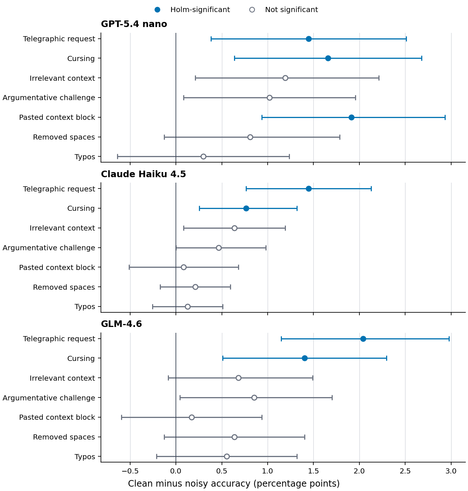
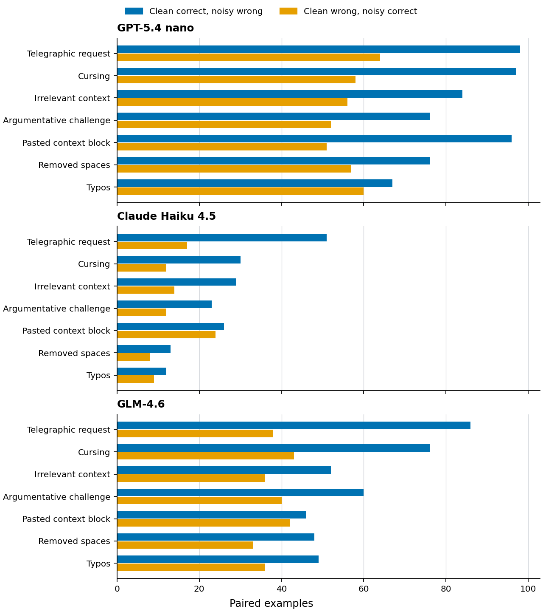

# Realistic-BFCL findings

## Research question

Does realistic surface variation change tool-calling accuracy when the intended
function and arguments are held constant? We study this question on paired BFCL
examples across three models and seven prompt dimensions. The analysis asks two
narrower questions: whether clean-to-noisy failures exceed noisy-to-clean
recoveries, and whether any effect recurs across the tested configurations.

Telegraphic requests and cursing produce statistically detectable degradation
for all three models after within-model multiplicity correction. Other effects
were not statistically detectable across all three models. These results
concern the evaluated single-turn BFCL tasks; they are not estimates of failure
rates in deployed agents.

## Method

The evaluation contains 2,351 base examples. Each clean prompt is paired with a
noisy prompt while holding the tool schema, accepted function calls and
arguments, BFCL evaluator, model, and serving route fixed. The
[dimension registry](../configs/realism_dimensions.yaml) identifies seven
frozen article dimensions: typos, cursing, irrelevant context, removed spaces,
argumentative challenge, pasted context, and telegraphic requests. Three
overlapping sandwich variants remained pilots; they also lacked the same frozen
full-pool, cross-model reviewed artifact and were excluded from the
article-facing cross-model analysis. Models were evaluated at temperature 0:
`gpt-5.4-nano`,
`claude-haiku-4-5-20251001`, and `z-ai/glm-4.6`.

Augmentations are intended to change phrasing rather than the oracle.
Deterministic checks reject changes to numbers, quoted strings, or visible gold
argument values; generated rows retain the original schema and ground truth.
These checks enforce observable invariants but do not replace semantic review.

For each model-dimension cell, `b` counts clean-correct/noisy-wrong pairs and
`c` counts clean-wrong/noisy-correct pairs. We report clean-minus-noisy accuracy,
an exact two-sided McNemar test, and Holm-adjusted p-values across the seven
dimensions within each model. The 95% percentile interval uses 10,000 bootstrap
resamples of paired binary differences with seed `20260618`. The complete
machine-readable result is the checked
[significance table](../artifacts/analysis/significance.csv); audit scopes are
documented with the [article artifacts](../artifacts/analysis/article/README.md).

## Results

Clean accuracy was 76.1% for GPT-5.4 nano, 83.2% for Claude Haiku 4.5, and 84.5%
for GLM-4.6. Changes below are absolute percentage points. Bold entries are the
only cells with Holm-adjusted `p <= 0.05`.

| Model | Dimension | Δ pp [95% CI] | b/c | Holm p |
|---|---|---:|---:|---:|
| GPT-5.4 nano | Telegraphic request | **1.4 [0.4, 2.5]** | **98/64** | **0.0465** |
| GPT-5.4 nano | Cursing | **1.7 [0.6, 2.7]** | **97/58** | **0.0130** |
| GPT-5.4 nano | Irrelevant context | 1.2 [0.2, 2.2] | 84/56 | 0.0886 |
| GPT-5.4 nano | Argumentative challenge | 1.0 [0.1, 2.0] | 76/52 | 0.1249 |
| GPT-5.4 nano | Pasted context block | **1.9 [0.9, 2.9]** | **96/51** | **0.0018** |
| GPT-5.4 nano | Removed spaces | 0.8 [-0.1, 1.8] | 76/57 | 0.2365 |
| GPT-5.4 nano | Typos | 0.3 [-0.6, 1.2] | 67/60 | 0.5946 |
| Claude Haiku 4.5 | Telegraphic request | **1.4 [0.8, 2.1]** | **51/17** | **0.00031** |
| Claude Haiku 4.5 | Cursing | **0.8 [0.3, 1.3]** | **30/12** | **0.0475** |
| Claude Haiku 4.5 | Irrelevant context | 0.6 [0.1, 1.2] | 29/14 | 0.1577 |
| Claude Haiku 4.5 | Argumentative challenge | 0.5 [0.0, 1.0] | 23/12 | 0.3581 |
| Claude Haiku 4.5 | Pasted context block | 0.1 [-0.5, 0.7] | 26/24 | 1.0000 |
| Claude Haiku 4.5 | Removed spaces | 0.2 [-0.2, 0.6] | 13/8 | 1.0000 |
| Claude Haiku 4.5 | Typos | 0.1 [-0.3, 0.5] | 12/9 | 1.0000 |
| GLM-4.6 | Telegraphic request | **2.0 [1.1, 3.0]** | **86/38** | **0.00014** |
| GLM-4.6 | Cursing | **1.4 [0.5, 2.3]** | **76/43** | **0.0191** |
| GLM-4.6 | Irrelevant context | 0.7 [-0.1, 1.5] | 52/36 | 0.4372 |
| GLM-4.6 | Argumentative challenge | 0.9 [0.0, 1.7] | 60/40 | 0.2844 |
| GLM-4.6 | Pasted context block | 0.2 [-0.6, 0.9] | 46/42 | 0.7493 |
| GLM-4.6 | Removed spaces | 0.6 [-0.1, 1.4] | 48/33 | 0.4372 |
| GLM-4.6 | Typos | 0.6 [-0.2, 1.3] | 49/36 | 0.4372 |

Telegraphic requests have the largest recurring effect. Cursing is smaller but
also recurs across models; the Haiku estimate is close to the decision
threshold. Pasted context is significant only for GPT-5.4 nano. Aggregate
degradation is not monotonic in clean accuracy, so the table does not support a
general claim that higher clean accuracy implies greater robustness.

The headline table uses raw paired outcomes, not human-screened labels. A
first-pass symmetric screen covered all 353 discordant outcomes in the four
significant Haiku and GLM cells; 224 (63.5%) were retained and 129 (36.5%) were
marked possible artifacts. After removing possible artifacts in both
directions, telegraphic requests remained significant for Haiku and GLM and
cursing remained significant for GLM under a seven-test Bonferroni check;
Haiku cursing did not. The nano audit lacks a matching complete fix-side review,
so no symmetric screened inference is reported for nano.

## Figures

*Figure 1. Clean-minus-noisy accuracy. Intervals are 95% paired bootstrap CIs;
filled points pass Holm correction, hollow points do not, and zero denotes no
directional change.*

*Figure 2. Regressions are clean-correct/noisy-wrong transitions; recoveries are
the reverse. Similar counts indicate added variance, whereas excess regressions
indicate directional degradation.*

The interval estimates and discordance counts are two views of the same paired
outcomes.

## Threats to validity

**Oracle validity.** Lexical invariants catch direct corruption but cannot prove
that every rewrite preserves all pragmatic constraints. The cross-run failure
trace combines 184 primary Haiku rows and 417 primary GLM rows with 621 rows
from a separate nano repeat; the headline nano cells instead contain 594
regressions. Of the trace's 1,222 clean-correct/noisy-wrong rows, 704 (57.6%)
were labeled
`true_model_failure`, 517 (42.3%) `possible_oracle_artifact`, and 1 (0.1%)
`uncertain`. It does not cover all paired examples or recovery rows and is not a
relabeling of the 21 headline cells. A separate realism audit purposively
sampled 40 of 594 headline nano regressions (6.7%); it was not a random sample.
Each of its four criteria
(oracle preservation, production-like style, natural style, and unchanged
active constraints) produced the same aggregate counts: 25 (62.5%) yes, 14
(35.0%) unclear, and 1 (2.5%) no. The stricter inclusion decision retained 20 of
40 (50.0%). All review stages were conducted by one researcher, were not
blinded, and provide no inter-annotator agreement estimate.

**Scope and external validity.** The perturbations are controlled synthetic
proxies, not a representative sample of production language. BFCL here is
single-turn, and only three models were tested. None is frontier-tier. GLM-4.6
was served through OpenRouter on a pinned DeepInfra route at unverified weight
precision; pairing supports internal comparison but not route-independent
absolute accuracy.

**Uncertainty and provenance.** Bootstrap differences were reconstructed from
the aggregate `b/c` contingency counts. This preserves the marginal paired-mean
distribution but cannot model category clustering. Current tooling requires a
completed run manifest and verifies repository, BFCL, config, input, and result
hashes. The checked comparison predates that enforcement and does not preserve
complete historical cost, timing, or raw provider metadata. The
[v0.1.0 release](https://github.com/yuvalmoscovitz/realistic-bfcl/releases/tag/v0.1.0)
freezes the noisy inputs and significance snapshot; it predates this revised
findings source and is not a complete archive of historical raw predictions.

## Implications for agentic tool use

Clean tool-calling accuracy should not be interpreted as evidence of invariance
to user phrasing. Evaluation should preserve example-level pairing and report
both failure and recovery directions: near-balanced discordance is evidence of
instability, whereas excess failures support directional degradation. In this
study, telegraphic input is the most consistent stressor; no other dimension
besides cursing was statistically detectable in all three configurations.

These results motivate adding oracle-preserving surface variants to tool-use
evaluation, especially for terse and multi-constraint requests. They do not
justify a universal claim about model capability or deployed-agent reliability.
The most informative extensions are a frontier-tier replication on the same
frozen pairs and independent, symmetric adjudication of discordant outcomes.
